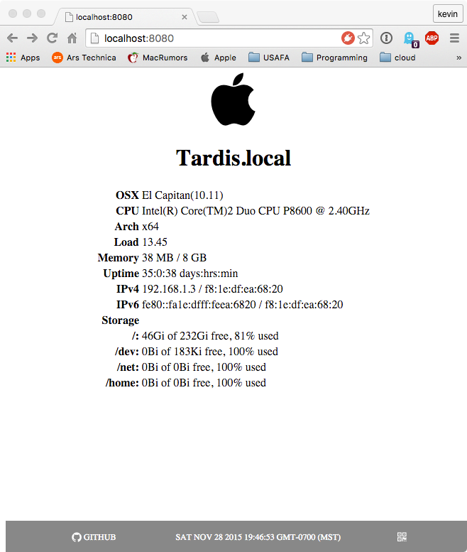

# Archeyjs

This is a simple archey like clone, which gives system info in a web browser.

Why? I have several headless Raspberry Pi's doing things and I wanted a simple cross
platform way to see what they are up too.

**still under development**

## Usage

Command line:

    [kevin@Tardis archeyjs]$ archeyjs -h

    Usage: index archeyjs [options]

    Options:

      -h, --help         output usage information
      -V, --version      output the version number
      -p, --port <port>  Http server port number, default: 8080
      -r, --no-static    Do real-time webpage updates

The `--no-static` option updates the web page in real-time with info that changes (i.e.,
load, memory, and time stamp). This uses `socket.io` with seems to use a lot of resources
to talk between the node server and the web page. The default is just a static page to
reduce resource requirements. **Thinking of removing real-time and just sticking with static 
webpages.**

The `--port` is the port used by the server. The default is `8080`.

You can connect with a web browser at:

    http://localhost:8080

Or get a json response back by:

    http://localhost:8080/json

Which gives:

    {"platform":"OSX",
    "load":"1.32",
    "release":{"name":"El Capitan","version":"10.11"},
    "uptime":"31:4:57 days:hrs:min",
    "free_memory":"28 MB",
    "total_memory":"8 GB",
    "cpu":"Intel(R) Core(TM)2 Duo CPU     P8600  @ 2.40GHz",
    "arch":"x64",
    "hostname":"Tardis.local",
    "network":{
      "IPv6":{
        "address":"fe80::fa1e:dfff:feea:6820",
        "mac":"f8:1e:df:ea:68:20"
        },
      "IPv4":{
        "address":"192.168.1.3",
        "mac":"f8:1e:df:ea:68:20"
        }
    },
    "timestamp":"2015-11-25T07:05:39.713Z"}

There is also a QR code icon in at the bottom right, which will create a QR code of the
hostname, IPv4, IPv6, and MAC address. You can also get to it by:

    http://localhost:8080/qr

## Curl

    curl -i -X GET http://localhost:8080/json

# Install

    npm install -g archeyjs

## Develop

    git clone https://github.com/walchko/archeyjs.git
    cd archeyjs
    npm install
    npm link

## Linux (Raspbian - Jessie) Setup

Create a file `/etc/systemd/system/archeyjs.service`:

    [Service]
    ExecStart=/usr/local/bin/archeyjs
    Restart=always
    StandardOutput=syslog
    StandardError=syslog
    SyslogIdentifier=archeyjs
    User=pi
    Group=pi
    Environment=NODE_ENV=production

    [Install]
    WantedBy=multi-user.target

Then do:

    sudo systemctl enable archeyjs.service
    sudo systemctl start archeyjs.service

Now you can use `sudo systemctl start|stop|status archeyjs.service` to start, stop, or
find the current status of the server.

# Change Log

| Version | Date       | Comments |
|---------|------------|----------|
| 1.1.0   | 2016/6/9   | Using font-linux now, icons for each OS instead of generic linux tux icon  |
| 1.0.9   | 2016/4/30  | Minor fixes  |
| 1.0.8   | 2016/4/20  | Cleaned up the storage reading |
| 1.0.7   | 2016/1/8   | Minor fixes |
| 1.0.6   | 2016/1/1   | Minor updates |
| 1.0.5   | 2015/11/30 | Documented systemd script for linux |
| 1.0.4   | 2015/11/29 | Documentation typo and bug fixes |
| 1.0.3   | 2015/11/28 | New real-time, QR, and storage status |
| 1.0.2   | 2015/11/25 | CLI fixes |
| 1.0.1   | 2015/11/25 | Small linux fixes |
| 1.0.0   | 2015/11/24 | Initiated |
