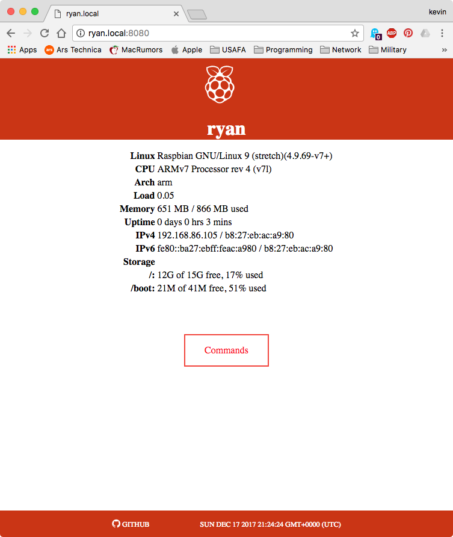
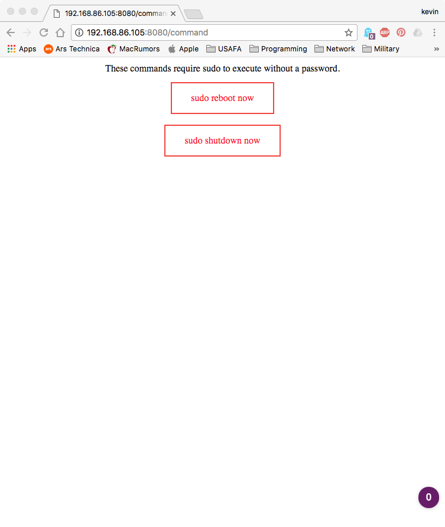

# Archeyjs

[](https://github.com/walchko/archeyjs)
[](https://github.com/walchko/archeyjs)
[](https://travis-ci.org/walchko/archeyjs)

[](https://nodei.co/npm/archeyjs/)

This is a simple archey like clone, which gives system info in a web browser.

Why? I have several headless Raspberry Pi's doing things and I wanted a simple cross
platform way to see what they are up too.


## Usage

Command line:

    [kevin@Tardis archeyjs]$ archeyjs -h

    Usage: index archeyjs [options]

    Options:

      -h, --help         output usage information
      -V, --version      output the version number
      -p, --port <port>  Http server port number, default: 8080

The `--port` is the port used by the server. The default is `8080`.

## Webpage



You can connect with a web browser using the default port 8080 at:

    http://localhost:8080




On Raspbian, you can issue the shutdown or reboot command by:

    http://localhost:8080/shutdown
    http://localhost:8080/reboot

Note, this works because Raspbian doesn't ask for a `sudo` password from user
`pi`. Therefore, this will probably not work on any other os.

## Server Responses

You can also see if the system is alive by getting a 200 response (no html):

    http://localhost:8080/alive

    {"hostname":"bob","network":{"wlan0":{"address":"10.0.6.16","mac":"b6:27:eb:7a:d8:49"}},"rpi":"Pi3B+ 1GB"}


Or get a json response back by:

    http://localhost:8080/json

Which gives:

    {"platform":"OSX",
    "load":"1.32",
    "release":{"name":"El Capitan","version":"10.11"},
    "uptime":"31:4:57 days:hrs:min",
    "free_memory":"28 MB",
    "total_memory":"8 GB",
    "cpu":"Intel(R) Core(TM)2 Duo CPU     P8600  @ 2.40GHz",
    "arch":"x64",
    "hostname":"Tardis.local",
    "network":{
      "IPv6":{
        "address":"fe00::fa1f:dfef:fe9a:6820",
        "mac":"f8:1e:df:ee:68:2f"
        },
      "IPv4":{
        "address":"192.168.1.3",
        "mac":"f8:1e:df:ee:11:2f"
        }
    },
    "timestamp":"2015-11-25T07:05:39.713Z"}

## Curl

    curl -i -X GET http://localhost:8080/json

# Install

    npm install -g archeyjs

## Develop

    git clone https://github.com/walchko/archeyjs.git
    cd archeyjs
    npm install
    npm link

## Linux (Raspbian - Stretch) Setup

There is now a script (`install-archeyjs.sh`) that does this, but the manual
process is basically:

Create a file `/etc/systemd/system/archeyjs.service`:

    [Service]
    ExecStart=/usr/local/bin/archeyjs
    Restart=always
    StandardOutput=syslog
    StandardError=syslog
    SyslogIdentifier=archeyjs
    User=pi
    Group=pi
    Environment=NODE_ENV=production

    [Install]
    WantedBy=multi-user.target

Then do:

    sudo systemctl enable archeyjs.service
    sudo systemctl start archeyjs.service

Now you can use `sudo systemctl start|stop|status archeyjs.service` to start, stop, or
find the current status of the server.

# Finding Systems

Using this, you could scan a network using `python` to find systems that respond to
the json interfaces:

```python
#!/usr/bin/env python

import time
import requests


for host in range(2,250):
    addr = "http://10.0.1." + str(host) + ":8080/json"
    try:
        resp = requests.get(addr, timeout=0.2)
        if resp.status_code == 200:
            print(">> {} at {}".format(
                resp.json()['hostname'],
                resp.json()['network']['IPv4']['address'])
            )
        elif resp.status_code == 400:
            print("** [400] at {}".format(addr))

    except KeyboardInterrupt:
        exit(0)
    except:
        print("** No RPi: {}".format(addr))
```

There is an `arjs_ping.py` program in the `bin` directory as a better example.

# To Do

- [ ] For Raspbian, incorporate more info:
    - temp (C or F)
    - version pi
    - bluetooth
    - wifi
    - memory split
- [ ] Cleaner break between gathering info and hosting web page
- [ ] Simple ping program to find any system with software installed

# Change Log

| Version | Date       | Comments |
|---------|------------|----------|
| 1.9.0   | 2019/09/07 | Added a ping function to scan network |
| 1.8.0   | 2019/09/03 | Focused on Raspberry Pi: eth0 and wlan0 reporting |
| 1.7.0   | 2017/12/09 | Added shutdown/reboot commands and general clean up |
| 1.6.0   | 2017/06/06 | Added techno-font |
| 1.5.0   | 2017/05/06 | Removed qr and realtime options and added font-linux |
| 1.3.0   | 2016/10/13 | Updates |
| 1.1.0   | 2016/06/09 | Using font-linux now, icons for each OS instead of generic linux tux icon  |
| 1.0.9   | 2016/4/30  | Minor fixes  |
| 1.0.8   | 2016/4/20  | Cleaned up the storage reading |
| 1.0.7   | 2016/1/8   | Minor fixes |
| 1.0.6   | 2016/1/1   | Minor updates |
| 1.0.5   | 2015/11/30 | Documented systemd script for linux |
| 1.0.4   | 2015/11/29 | Documentation typo and bug fixes |
| 1.0.3   | 2015/11/28 | New real-time, QR, and storage status |
| 1.0.2   | 2015/11/25 | CLI fixes |
| 1.0.1   | 2015/11/25 | Small linux fixes |
| 1.0.0   | 2015/11/24 | Initiated |

# MIT License

**Copyright (c) 2015 Kevin Walchko**

Permission is hereby granted, free of charge, to any person obtaining a copy
of this software and associated documentation files (the "Software"), to deal
in the Software without restriction, including without limitation the rights
to use, copy, modify, merge, publish, distribute, sublicense, and/or sell
copies of the Software, and to permit persons to whom the Software is
furnished to do so, subject to the following conditions:

The above copyright notice and this permission notice shall be included in all
copies or substantial portions of the Software.

THE SOFTWARE IS PROVIDED "AS IS", WITHOUT WARRANTY OF ANY KIND, EXPRESS OR
IMPLIED, INCLUDING BUT NOT LIMITED TO THE WARRANTIES OF MERCHANTABILITY,
FITNESS FOR A PARTICULAR PURPOSE AND NONINFRINGEMENT. IN NO EVENT SHALL THE
AUTHORS OR COPYRIGHT HOLDERS BE LIABLE FOR ANY CLAIM, DAMAGES OR OTHER
LIABILITY, WHETHER IN AN ACTION OF CONTRACT, TORT OR OTHERWISE, ARISING FROM,
OUT OF OR IN CONNECTION WITH THE SOFTWARE OR THE USE OR OTHER DEALINGS IN THE
SOFTWARE.
